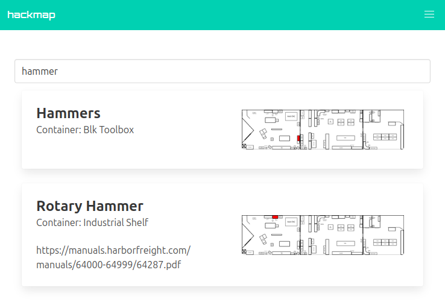

# hackmap

a quick and dirty web app to look up where things are at hackrva.

## running
This should be easy to run if you have [golang](https://go.dev/doc/install) and [air](https://github.com/air-verse/air) installed 

install `air`:
```bash
go install github.com/air-verse/air@latest
```

This should install `air` to `~/go/bin` (you may want to add `~/go/bin` to your PATH.

Then you can run the server with the following command.
```bash
air
```

> This should do hot reloading if you make changes to the code.

## Usage

Hackmap takes a spreadsheet and builds a map from that data.
You can add something to the map as either a container or an item.  

A 'container' will show some physical representation on the map.  
An 'item' will show its physical representation as whatever 'container' that it's in.
e.g. if you search for something like 'ketchup' it will highlight the refrigerator container on the map.

[https://map.hackrva.org](https://map.hackrva.org)



